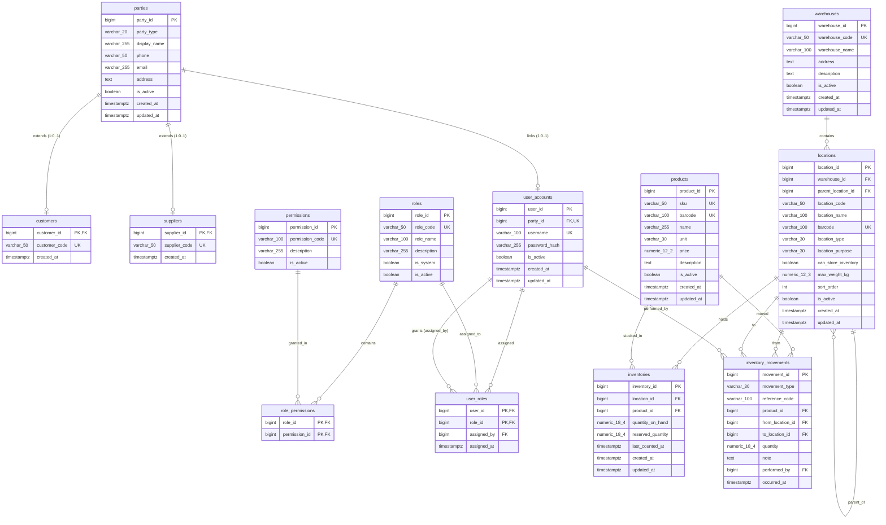

# Entity Relationship Diagram (ERD)

Hệ thống bao gồm 6 module chính: `parties`, `auth`, `rbac`, `warehouse`, `products`, `inventory` với 11 bảng dữ liệu.

```mermaid
erDiagram
    %% ==========================================
    %% MODULE: PARTIES & AUTH
    %% ==========================================
    parties {
        bigint party_id PK
        varchar_20 party_type
        varchar_255 display_name
        varchar_50 phone
        varchar_255 email
        text address
        boolean is_active
        timestamptz created_at
        timestamptz updated_at
    }

    customers {
        bigint customer_id PK, FK
        varchar_50 customer_code UK
        timestamptz created_at
    }

    suppliers {
        bigint supplier_id PK, FK
        varchar_50 supplier_code UK
        timestamptz created_at
    }

    user_accounts {
        bigint user_id PK
        bigint party_id FK, UK
        varchar_100 username UK
        varchar_255 password_hash
        boolean is_active
        timestamptz created_at
        timestamptz updated_at
    }

    %% ==========================================
    %% MODULE: RBAC
    %% ==========================================
    roles {
        bigint role_id PK
        varchar_50 role_code UK
        varchar_100 role_name
        varchar_255 description
        boolean is_system
        boolean is_active
    }

    permissions {
        bigint permission_id PK
        varchar_100 permission_code UK
        varchar_255 description
        boolean is_active
    }

    role_permissions {
        bigint role_id PK, FK
        bigint permission_id PK, FK
    }

    user_roles {
        bigint user_id PK, FK
        bigint role_id PK, FK
        bigint assigned_by FK
        timestamptz assigned_at
    }

    %% ==========================================
    %% MODULE: WAREHOUSE
    %% ==========================================
    warehouses {
        bigint warehouse_id PK
        varchar_50 warehouse_code UK
        varchar_100 warehouse_name
        text address
        text description
        boolean is_active
        timestamptz created_at
        timestamptz updated_at
    }

    locations {
        bigint location_id PK
        bigint warehouse_id FK
        bigint parent_location_id FK
        varchar_50 location_code
        varchar_100 location_name
        varchar_100 barcode UK
        varchar_30 location_type
        varchar_30 location_purpose
        boolean can_store_inventory
        numeric_12_3 max_weight_kg
        int sort_order
        boolean is_active
        timestamptz created_at
        timestamptz updated_at
    }

    %% ==========================================
    %% MODULE: PRODUCTS
    %% ==========================================
    products {
        bigint product_id PK
        varchar_50 sku UK
        varchar_100 barcode UK
        varchar_255 name
        varchar_30 unit
        numeric_12_2 price
        text description
        boolean is_active
        timestamptz created_at
        timestamptz updated_at
    }

    %% ==========================================
    %% MODULE: INVENTORY
    %% ==========================================
    inventories {
        bigint inventory_id PK
        bigint location_id FK
        bigint product_id FK
        numeric_18_4 quantity_on_hand
        numeric_18_4 reserved_quantity
        timestamptz last_counted_at
        timestamptz created_at
        timestamptz updated_at
    }

    inventory_movements {
        bigint movement_id PK
        varchar_30 movement_type
        varchar_100 reference_code
        bigint product_id FK
        bigint from_location_id FK
        bigint to_location_id FK
        numeric_18_4 quantity
        text note
        bigint performed_by FK
        timestamptz occurred_at
    }

    %% ==========================================
    %% RELATIONSHIPS
    %% ==========================================
    parties ||--o| customers : "extends (1:0..1)"
    parties ||--o| suppliers : "extends (1:0..1)"
    parties ||--o| user_accounts : "links (1:0..1)"

    user_accounts ||--o{ user_roles : "assigned"
    roles ||--o{ user_roles : "assigned_to"
    user_accounts ||--o{ user_roles : "grants (assigned_by)"

    roles ||--o{ role_permissions : "contains"
    permissions ||--o{ role_permissions : "granted_in"

    warehouses ||--o{ locations : "contains"
    locations ||--o{ locations : "parent_of"

    locations ||--o{ inventories : "holds"
    products ||--o{ inventories : "stocked_in"

    products ||--o{ inventory_movements : "moved"
    locations ||--o{ inventory_movements : "from"
    locations ||--o{ inventory_movements : "to"
    user_accounts ||--o{ inventory_movements : "performed_by"
```
