# Thiết Kế Cơ Sở Dữ Liệu Quy Trình Bảo Trì Thiết Bị (ERD & DBML)

Tài liệu chuẩn hóa thiết kế Database cho quy trình bảo trì 3 giai đoạn:
- **Giai đoạn 1**: Tiếp nhận & ghi nhận yêu cầu bảo trì $\rightarrow$ Chuyển thành Work Order.
- **Giai đoạn 2**: Chẩn đoán, kiểm tra tồn kho & cấp phát phụ tùng sửa chữa.
- **Giai đoạn 3**: Đề nghị mua phụ tùng thiếu, phê duyệt đa cấp, nhận hàng - kiểm định kỹ thuật & nghiệm thu đóng Work Order.

---

## 1. Sơ Đồ Mermaid ERD

```mermaid
erDiagram

    %% =========================================================
    %% BẢNG HỆ THỐNG HIỆN HỮU (CORE INTEGRATION)
    %% =========================================================

    suppliers {
        bigint supplier_id PK
        varchar_50 supplier_code UK
        timestamptz created_at
    }

    user_accounts {
        bigint user_id PK
        bigint party_id FK
        varchar_100 username UK
        boolean is_active
    }

    warehouses {
        bigint warehouse_id PK
        varchar_50 warehouse_code UK
        varchar_100 warehouse_name
    }

    locations {
        bigint location_id PK
        bigint warehouse_id FK
        bigint parent_location_id FK
        varchar_50 location_code
        varchar_100 location_name
    }

    products {
        bigint product_id PK
        varchar_50 sku UK
        varchar_255 name
        varchar_30 unit
        numeric_12_2 price
    }

    inventories {
        bigint inventory_id PK
        bigint location_id FK
        bigint product_id FK
        numeric_18_4 quantity_on_hand
        numeric_18_4 reserved_quantity
    }

    inventory_movements {
        bigint movement_id PK
        varchar_30 movement_type
        varchar_100 reference_code
        bigint product_id FK
        bigint from_location_id FK
        bigint to_location_id FK
        numeric_18_4 quantity
        bigint performed_by FK
        timestamptz occurred_at
    }

    %% =========================================================
    %% MODULE: EQUIPMENT (QUẢN LÝ THIẾT BỊ)
    %% =========================================================

    equipment_types {
        bigint equipment_type_id PK
        varchar_50 type_code UK
        varchar_100 type_name
        varchar_100 manufacturer
        text description
        boolean is_active
    }

    equipment {
        bigint equipment_id PK
        varchar_50 equipment_code UK
        varchar_255 equipment_name
        bigint equipment_type_id FK
        varchar_100 serial_number UK
        bigint warehouse_id FK
        bigint location_id FK
        bigint supplier_id FK
        varchar_30 status
        date purchase_date
        date warranty_expiry
        boolean is_active
        timestamptz created_at
        timestamptz updated_at
    }

    %% =========================================================
    %% MODULE: REQUEST & WORK ORDER (GIAI ĐOẠN 1 & 2)
    %% =========================================================

    maintenance_requests {
        bigint request_id PK
        varchar_50 request_code UK
        bigint equipment_id FK
        bigint reported_by FK
        varchar_30 priority
        varchar_30 status
        varchar_255 title
        text problem_description
        bigint reviewed_by FK
        timestamptz reviewed_at
        text review_note
        timestamptz created_at
        timestamptz updated_at
    }

    work_orders {
        bigint work_order_id PK
        varchar_50 work_order_code UK
        bigint request_id FK, UK
        bigint assigned_to FK
        bigint supervisor_id FK
        varchar_30 maintenance_type
        varchar_30 priority
        varchar_30 status
        text problem_description
        text root_cause
        text repair_action
        text test_result
        varchar_30 acceptance_result
        bigint accepted_by FK
        timestamptz accepted_at
        text acceptance_note
        timestamptz planned_start_at
        timestamptz planned_end_at
        timestamptz actual_start_at
        timestamptz actual_end_at
        timestamptz downtime_start
        timestamptz downtime_end
        timestamptz closed_at
        timestamptz created_at
        timestamptz updated_at
    }

    work_order_tasks {
        bigint task_id PK
        bigint work_order_id FK
        int task_order
        varchar_255 task_name
        text description
        bigint assigned_to FK
        numeric_6_2 estimated_hours
        varchar_30 status
        timestamptz started_at
        timestamptz completed_at
    }

    work_order_logs {
        bigint log_id PK
        bigint work_order_id FK
        bigint task_id FK
        bigint technician_id FK
        varchar_50 activity_type
        numeric_6_2 labor_hours
        text work_description
        timestamptz logged_at
    }

    %% =========================================================
    %% MODULE: SPARE PARTS (GIAI ĐOẠN 2 - QUẢN LÝ PHỤ TÙNG)
    %% =========================================================

    work_order_materials {
        bigint work_order_material_id PK
        bigint work_order_id FK
        bigint product_id FK
        numeric_18_4 required_quantity
        numeric_18_4 reserved_quantity
        numeric_18_4 issued_quantity
        varchar_30 status
        text note
        timestamptz created_at
    }

    %% =========================================================
    %% MODULE: PROCUREMENT & APPROVAL (GIAI ĐOẠN 3 - MUA HÀNG & PHÊ DUYỆT)
    %% =========================================================

    purchase_requests {
        bigint purchase_request_id PK
        varchar_50 request_code UK
        bigint work_order_id FK
        bigint requested_by FK
        varchar_30 priority
        varchar_30 status
        numeric_14_2 total_estimated_amount
        text reason
        timestamptz requested_at
        timestamptz created_at
    }

    purchase_request_items {
        bigint purchase_request_item_id PK
        bigint purchase_request_id FK
        bigint work_order_material_id FK
        bigint product_id FK
        numeric_18_4 requested_quantity
        numeric_12_2 estimated_unit_price
        date required_date
        varchar_30 status
    }

    purchase_approvals {
        bigint approval_id PK
        bigint purchase_request_id FK
        bigint approver_id FK
        int step_order
        varchar_30 approver_role
        varchar_30 status
        text comment
        timestamptz acted_at
    }

    purchase_orders {
        bigint purchase_order_id PK
        varchar_50 po_code UK
        bigint purchase_request_id FK
        bigint supplier_id FK
        bigint warehouse_id FK
        varchar_30 status
        date order_date
        date expected_delivery_date
        numeric_14_2 total_amount
        bigint created_by FK
        timestamptz created_at
    }

    purchase_order_items {
        bigint po_item_id PK
        bigint purchase_order_id FK
        bigint purchase_request_item_id FK
        bigint product_id FK
        numeric_18_4 ordered_quantity
        numeric_12_2 unit_price
        numeric_14_2 line_total
    }

    %% =========================================================
    %% MODULE: GOODS RECEIPT & INSPECTION (GIAI ĐOẠN 3 - NHẬN VÀ KIỂM ĐỊNH)
    %% =========================================================

    goods_receipts {
        bigint receipt_id PK
        varchar_50 receipt_code UK
        bigint purchase_order_id FK
        bigint warehouse_id FK
        bigint received_by FK
        varchar_30 status
        timestamptz received_at
        text note
    }

    goods_receipt_items {
        bigint receipt_item_id PK
        bigint receipt_id FK
        bigint po_item_id FK
        bigint product_id FK
        bigint inventory_movement_id FK
        numeric_18_4 received_quantity
        numeric_18_4 accepted_quantity
        numeric_18_4 rejected_quantity
        varchar_30 inspection_status
        bigint inspected_by FK
        text inspection_note
        timestamptz inspected_at
    }

    %% =========================================================
    %% MỐI QUAN HỆ (RELATIONSHIPS)
    %% =========================================================

    %% Core Warehouse & Inventory relationships
    warehouses ||--o{ locations : "contains"
    locations ||--o{ locations : "parent_of"
    locations ||--o{ inventories : "holds"
    products ||--o{ inventories : "stocked_in"
    products ||--o{ inventory_movements : "moved"
    locations ||--o{ inventory_movements : "from"
    locations ||--o{ inventory_movements : "to"
    user_accounts ||--o{ inventory_movements : "performed_by"

    %% Equipment & Requests
    equipment_types ||--o{ equipment : "categorizes"
    warehouses ||--o{ equipment : "stores_at"
    locations ||--o{ equipment : "placed_at"
    suppliers ||--o{ equipment : "supplied_by"

    equipment ||--o{ maintenance_requests : "subject_of"
    user_accounts ||--o{ maintenance_requests : "reported_by"
    user_accounts ||--o{ maintenance_requests : "reviewed_by"

    maintenance_requests ||--o| work_orders : "converted_to"
    user_accounts ||--o{ work_orders : "assigned_tech"
    user_accounts ||--o{ work_orders : "supervised_by"
    user_accounts ||--o{ work_orders : "accepted_by"

    work_orders ||--o{ work_order_tasks : "decomposed_into"
    user_accounts ||--o{ work_order_tasks : "task_assigned_to"
    work_orders ||--o{ work_order_logs : "records_hours"
    work_order_tasks ||--o{ work_order_logs : "task_log"
    user_accounts ||--o{ work_order_logs : "logged_by"

    work_orders ||--o{ work_order_materials : "requires"
    products ||--o{ work_order_materials : "spare_part"

    work_orders ||--o{ purchase_requests : "triggers"
    user_accounts ||--o{ purchase_requests : "created_by"

    purchase_requests ||--o{ purchase_request_items : "contains"
    work_order_materials ||--o{ purchase_request_items : "fulfills_shortage"
    products ||--o{ purchase_request_items : "items"

    purchase_requests ||--o{ purchase_approvals : "workflow"
    user_accounts ||--o{ purchase_approvals : "acted_by"

    purchase_requests ||--o{ purchase_orders : "generates"
    suppliers ||--o{ purchase_orders : "issued_to"
    warehouses ||--o{ purchase_orders : "delivered_to"
    user_accounts ||--o{ purchase_orders : "created_by"

    purchase_orders ||--o{ purchase_order_items : "lines"
    purchase_request_items ||--o{ purchase_order_items : "sourced_from"
    products ||--o{ purchase_order_items : "ordered_item"

    purchase_orders ||--o{ goods_receipts : "delivered_under"
    warehouses ||--o{ goods_receipts : "received_at"
    user_accounts ||--o{ goods_receipts : "receiver"

    goods_receipts ||--o{ goods_receipt_items : "received_lines"
    purchase_order_items ||--o{ goods_receipt_items : "against_po_line"
    products ||--o{ goods_receipt_items : "received_product"
    user_accounts ||--o{ goods_receipt_items : "inspected_by"
    inventory_movements ||--o| goods_receipt_items : "generates_movement"
```



---

## 2. Bản Đồ Trạng Thái (Lifecycle Mapping Theo 3 Giai Đoạn)

1. **Giai đoạn 1 (Tiếp nhận & Tạo WO)**:
   - `maintenance_requests`: `SUBMITTED` ➔ `REVIEWED` ➔ `APPROVED` (chuyển sang WO) hoặc `REJECTED`.
   - `work_orders`: Sinh mã tự động, trạng thái khởi tạo `ASSIGNED`.

2. **Giai đoạn 2 (Chẩn đoán, Vật tư & Sửa chữa)**:
   - `work_orders`: Chuyển sang `IN_PROGRESS` (KTV kiểm tra máy, ghi `root_cause`).
   - Kiểm tra tồn kho:
     - **Đủ hàng**: `work_order_materials.status = RESERVED` (tăng `inventories.reserved_quantity`), sau đó xuất kho qua `inventory_movements` (type `MAINTENANCE_ISSUE`) ➔ `status = ISSUED`.
     - **Thiếu hàng**: `work_order_materials.status = PENDING_PURCHASE` ➔ `work_orders.status = WAITING_PARTS`.

3. **Giai đoạn 3 (Mua hàng, Nghiệm thu & Đóng WO)**:
   - **Đề nghị mua**: `purchase_requests` duyệt đa cấp qua `purchase_approvals` (Trưởng bộ phận $\rightarrow$ Kế toán $\rightarrow$ Giám đốc).
   - **Đặt hàng**: `purchase_orders` gửi nhà cung cấp (`suppliers`).
   - **Nhận & Kiểm tra**: Kho nhận (`goods_receipts`), KTV nghiệm thu chất lượng phụ tùng (`goods_receipt_items.inspection_status = PASSED`), tự động tạo `inventory_movements` (type `PURCHASE_RECEIPT`) và tự động chuyển sang cấp phát cho Work Order.
   - **Chạy thử & Nghiệm thu**: KTV ghi `test_result`, Quản lý/Người vận hành xác nhận `acceptance_result = ACCEPTED` ➔ đóng WO (`CLOSED`). Toàn bộ lịch sử bảo trì thiết bị được truy vấn trực tiếp từ bảng `work_orders` theo `equipment_id`.

---

## 3. Mã Nguồn DBML (Dùng vẽ ERD trên [dbdiagram.io](https://dbdiagram.io))

```dbml
// =========================================================
// HỆ THỐNG HIỆN HỮU (CORE INTEGRATION)
// =========================================================

Table suppliers {
  supplier_id bigint [pk, increment]
  supplier_code varchar(50) [unique, not null]
  created_at timestamptz [default: `now()`]
}

Table user_accounts {
  user_id bigint [pk, increment]
  party_id bigint [not null]
  username varchar(100) [unique, not null]
  is_active boolean [default: true]
  created_at timestamptz [default: `now()`]
}

Table warehouses {
  warehouse_id bigint [pk, increment]
  warehouse_code varchar(50) [unique, not null]
  warehouse_name varchar(100) [not null]
  is_active boolean [default: true]
}

Table locations {
  location_id bigint [pk, increment]
  warehouse_id bigint [not null]
  parent_location_id bigint
  location_code varchar(50) [not null]
  location_name varchar(100) [not null]
  can_store_inventory boolean [default: false]
}

Table products {
  product_id bigint [pk, increment]
  sku varchar(50) [unique, not null]
  name varchar(255) [not null]
  unit varchar(30) [default: 'item']
  price numeric(12,2) [default: 0]
  is_active boolean [default: true]
}

Table inventories {
  inventory_id bigint [pk, increment]
  location_id bigint [not null]
  product_id bigint [not null]
  quantity_on_hand numeric(18,4) [default: 0]
  reserved_quantity numeric(18,4) [default: 0]
}

Table inventory_movements {
  movement_id bigint [pk, increment]
  movement_type varchar(30) [not null, note: 'MAINTENANCE_ISSUE, PURCHASE_RECEIPT, ADJUSTMENT']
  reference_code varchar(100)
  product_id bigint [not null]
  from_location_id bigint
  to_location_id bigint
  quantity numeric(18,4) [not null]
  performed_by bigint
  occurred_at timestamptz [default: `now()`]
}

// =========================================================
// MODULE: EQUIPMENT & ASSET
// =========================================================

Table equipment_types {
  equipment_type_id bigint [pk, increment]
  type_code varchar(50) [unique, not null]
  type_name varchar(100) [not null]
  manufacturer varchar(100)
  description text
  is_active boolean [default: true]
}

Table equipment {
  equipment_id bigint [pk, increment]
  equipment_code varchar(50) [unique, not null]
  equipment_name varchar(255) [not null]
  equipment_type_id bigint [not null]
  serial_number varchar(100) [unique]
  warehouse_id bigint
  location_id bigint
  supplier_id bigint
  status varchar(30) [default: 'OPERATIONAL', note: 'OPERATIONAL, UNDER_MAINTENANCE, DECOMMISSIONED']
  purchase_date date
  warranty_expiry date
  is_active boolean [default: true]
  created_at timestamptz [default: `now()`]
  updated_at timestamptz [default: `now()`]
}

// =========================================================
// MODULE: MAINTENANCE REQUEST & WORK ORDER
// =========================================================

Table maintenance_requests {
  request_id bigint [pk, increment]
  request_code varchar(50) [unique, not null]
  equipment_id bigint [not null]
  reported_by bigint [not null]
  priority varchar(30) [default: 'MEDIUM', note: 'LOW, MEDIUM, HIGH, URGENT']
  status varchar(30) [default: 'SUBMITTED', note: 'SUBMITTED, REVIEWED, APPROVED, REJECTED']
  title varchar(255) [not null]
  problem_description text [not null]
  reviewed_by bigint
  reviewed_at timestamptz
  review_note text
  created_at timestamptz [default: `now()`]
  updated_at timestamptz [default: `now()`]
}

Table work_orders {
  work_order_id bigint [pk, increment]
  work_order_code varchar(50) [unique, not null]
  request_id bigint [unique, note: '1:1 converted from maintenance_requests']
  assigned_to bigint [note: 'Lead technician']
  supervisor_id bigint [note: 'Manager / Supervisor']
  maintenance_type varchar(30) [default: 'CORRECTIVE', note: 'CORRECTIVE, PREVENTIVE']
  priority varchar(30) [default: 'MEDIUM']
  status varchar(30) [default: 'ASSIGNED', note: 'ASSIGNED, IN_PROGRESS, WAITING_PARTS, TESTING, COMPLETED, CLOSED, CANCELLED']
  problem_description text
  root_cause text
  repair_action text
  test_result text
  acceptance_result varchar(30) [note: 'ACCEPTED, REJECTED']
  accepted_by bigint [note: 'Manager / Operator']
  accepted_at timestamptz
  acceptance_note text
  planned_start_at timestamptz
  planned_end_at timestamptz
  actual_start_at timestamptz
  actual_end_at timestamptz
  downtime_start timestamptz
  downtime_end timestamptz
  closed_at timestamptz
  created_at timestamptz [default: `now()`]
  updated_at timestamptz [default: `now()`]
}

Table work_order_tasks {
  task_id bigint [pk, increment]
  work_order_id bigint [not null]
  task_order int [default: 1]
  task_name varchar(255) [not null]
  description text
  assigned_to bigint [note: 'Assigned technician']
  estimated_hours numeric(6,2)
  status varchar(30) [default: 'PENDING', note: 'PENDING, IN_PROGRESS, COMPLETED']
  started_at timestamptz
  completed_at timestamptz
}

Table work_order_logs {
  log_id bigint [pk, increment]
  work_order_id bigint [not null]
  task_id bigint [note: 'Associated task']
  technician_id bigint [not null]
  activity_type varchar(50) [note: 'DIAGNOSIS, REPAIR, TESTING']
  labor_hours numeric(6,2) [not null]
  work_description text
  logged_at timestamptz [default: `now()`]
}

Table work_order_materials {
  work_order_material_id bigint [pk, increment]
  work_order_id bigint [not null]
  product_id bigint [not null, note: 'Spare part from products catalog']
  required_quantity numeric(18,4) [not null]
  reserved_quantity numeric(18,4) [default: 0]
  issued_quantity numeric(18,4) [default: 0]
  status varchar(30) [default: 'PENDING', note: 'PENDING, RESERVED, ISSUED, PENDING_PURCHASE']
  note text
  created_at timestamptz [default: `now()`]
}

// =========================================================
// MODULE: PROCUREMENT & APPROVAL
// =========================================================

Table purchase_requests {
  purchase_request_id bigint [pk, increment]
  request_code varchar(50) [unique, not null]
  work_order_id bigint
  requested_by bigint [not null]
  priority varchar(30) [default: 'MEDIUM']
  status varchar(30) [default: 'DRAFT', note: 'DRAFT, PENDING_APPROVAL, APPROVED, REJECTED, ORDERED']
  total_estimated_amount numeric(14,2) [default: 0]
  reason text
  requested_at timestamptz [default: `now()`]
  created_at timestamptz [default: `now()`]
}

Table purchase_request_items {
  purchase_request_item_id bigint [pk, increment]
  purchase_request_id bigint [not null]
  work_order_material_id bigint [note: 'Links directly to shortage material']
  product_id bigint [not null]
  requested_quantity numeric(18,4) [not null]
  estimated_unit_price numeric(12,2) [default: 0]
  required_date date
  status varchar(30) [default: 'PENDING']
}

Table purchase_approvals {
  approval_id bigint [pk, increment]
  purchase_request_id bigint [not null]
  approver_id bigint [not null]
  step_order int [not null, note: '1: Manager, 2: Accounting, 3: Director']
  approver_role varchar(30) [not null]
  status varchar(30) [default: 'PENDING', note: 'PENDING, APPROVED, REJECTED']
  comment text
  acted_at timestamptz
}

Table purchase_orders {
  purchase_order_id bigint [pk, increment]
  po_code varchar(50) [unique, not null]
  purchase_request_id bigint
  supplier_id bigint [not null]
  warehouse_id bigint [not null]
  status varchar(30) [default: 'ISSUED', note: 'ISSUED, PARTIALLY_RECEIVED, COMPLETED, CANCELLED']
  order_date date [not null]
  expected_delivery_date date
  total_amount numeric(14,2) [default: 0]
  created_by bigint [not null]
  created_at timestamptz [default: `now()`]
}

Table purchase_order_items {
  po_item_id bigint [pk, increment]
  purchase_order_id bigint [not null]
  purchase_request_item_id bigint
  product_id bigint [not null]
  ordered_quantity numeric(18,4) [not null]
  unit_price numeric(12,2) [not null]
  line_total numeric(14,2) [not null]
}

Table goods_receipts {
  receipt_id bigint [pk, increment]
  receipt_code varchar(50) [unique, not null]
  purchase_order_id bigint [not null]
  warehouse_id bigint [not null]
  received_by bigint [not null]
  status varchar(30) [default: 'RECEIVED', note: 'RECEIVED, INSPECTED, STOCKED']
  received_at timestamptz [default: `now()`]
  note text
}

Table goods_receipt_items {
  receipt_item_id bigint [pk, increment]
  receipt_id bigint [not null]
  po_item_id bigint [not null]
  product_id bigint [not null]
  inventory_movement_id bigint [note: 'Generated when inspection PASSED']
  received_quantity numeric(18,4) [not null]
  accepted_quantity numeric(18,4) [default: 0]
  rejected_quantity numeric(18,4) [default: 0]
  inspection_status varchar(30) [default: 'PENDING', note: 'PENDING, PASSED, REJECTED, PARTIAL']
  inspected_by bigint [note: 'Technician inspecting parts']
  inspection_note text
  inspected_at timestamptz
}

// =========================================================
// RELATIONSHIPS (REFERENCES)
// =========================================================

// Core Warehouse & Inventory
Ref: locations.warehouse_id > warehouses.warehouse_id
Ref: locations.parent_location_id > locations.location_id
Ref: inventories.location_id > locations.location_id
Ref: inventories.product_id > products.product_id
Ref: inventory_movements.product_id > products.product_id
Ref: inventory_movements.from_location_id > locations.location_id
Ref: inventory_movements.to_location_id > locations.location_id
Ref: inventory_movements.performed_by > user_accounts.user_id

// Equipment & Maintenance
Ref: equipment.equipment_type_id > equipment_types.equipment_type_id
Ref: equipment.warehouse_id > warehouses.warehouse_id
Ref: equipment.location_id > locations.location_id
Ref: equipment.supplier_id > suppliers.supplier_id

Ref: maintenance_requests.equipment_id > equipment.equipment_id
Ref: maintenance_requests.reported_by > user_accounts.user_id
Ref: maintenance_requests.reviewed_by > user_accounts.user_id

Ref: work_orders.request_id - maintenance_requests.request_id
Ref: work_orders.assigned_to > user_accounts.user_id
Ref: work_orders.supervisor_id > user_accounts.user_id
Ref: work_orders.accepted_by > user_accounts.user_id

Ref: work_order_tasks.work_order_id > work_orders.work_order_id
Ref: work_order_tasks.assigned_to > user_accounts.user_id

Ref: work_order_logs.work_order_id > work_orders.work_order_id
Ref: work_order_logs.task_id > work_order_tasks.task_id
Ref: work_order_logs.technician_id > user_accounts.user_id

Ref: work_order_materials.work_order_id > work_orders.work_order_id
Ref: work_order_materials.product_id > products.product_id

Ref: purchase_requests.work_order_id > work_orders.work_order_id
Ref: purchase_requests.requested_by > user_accounts.user_id

Ref: purchase_request_items.purchase_request_id > purchase_requests.purchase_request_id
Ref: purchase_request_items.work_order_material_id > work_order_materials.work_order_material_id
Ref: purchase_request_items.product_id > products.product_id

Ref: purchase_approvals.purchase_request_id > purchase_requests.purchase_request_id
Ref: purchase_approvals.approver_id > user_accounts.user_id

Ref: purchase_orders.purchase_request_id > purchase_requests.purchase_request_id
Ref: purchase_orders.supplier_id > suppliers.supplier_id
Ref: purchase_orders.warehouse_id > warehouses.warehouse_id
Ref: purchase_orders.created_by > user_accounts.user_id

Ref: purchase_order_items.purchase_order_id > purchase_orders.purchase_order_id
Ref: purchase_order_items.purchase_request_item_id > purchase_request_items.purchase_request_item_id
Ref: purchase_order_items.product_id > products.product_id

Ref: goods_receipts.purchase_order_id > purchase_orders.purchase_order_id
Ref: goods_receipts.warehouse_id > warehouses.warehouse_id
Ref: goods_receipts.received_by > user_accounts.user_id

Ref: goods_receipt_items.receipt_id > goods_receipts.receipt_id
Ref: goods_receipt_items.po_item_id > purchase_order_items.po_item_id
Ref: goods_receipt_items.product_id > products.product_id
Ref: goods_receipt_items.inspected_by > user_accounts.user_id
Ref: goods_receipt_items.inventory_movement_id - inventory_movements.movement_id

// =========================================================
// TABLE GROUPS
// =========================================================

TableGroup Core_Inventory {
  warehouses
  locations
  products
  inventories
  inventory_movements
  suppliers
  user_accounts
}

TableGroup Maintenance_Execution {
  equipment_types
  equipment
  maintenance_requests
  work_orders
  work_order_logs
  work_order_materials
}

TableGroup Purchasing_Receipt {
  purchase_requests
  purchase_request_items
  purchase_approvals
  purchase_orders
  purchase_order_items
  goods_receipts
  goods_receipt_items
}
```
